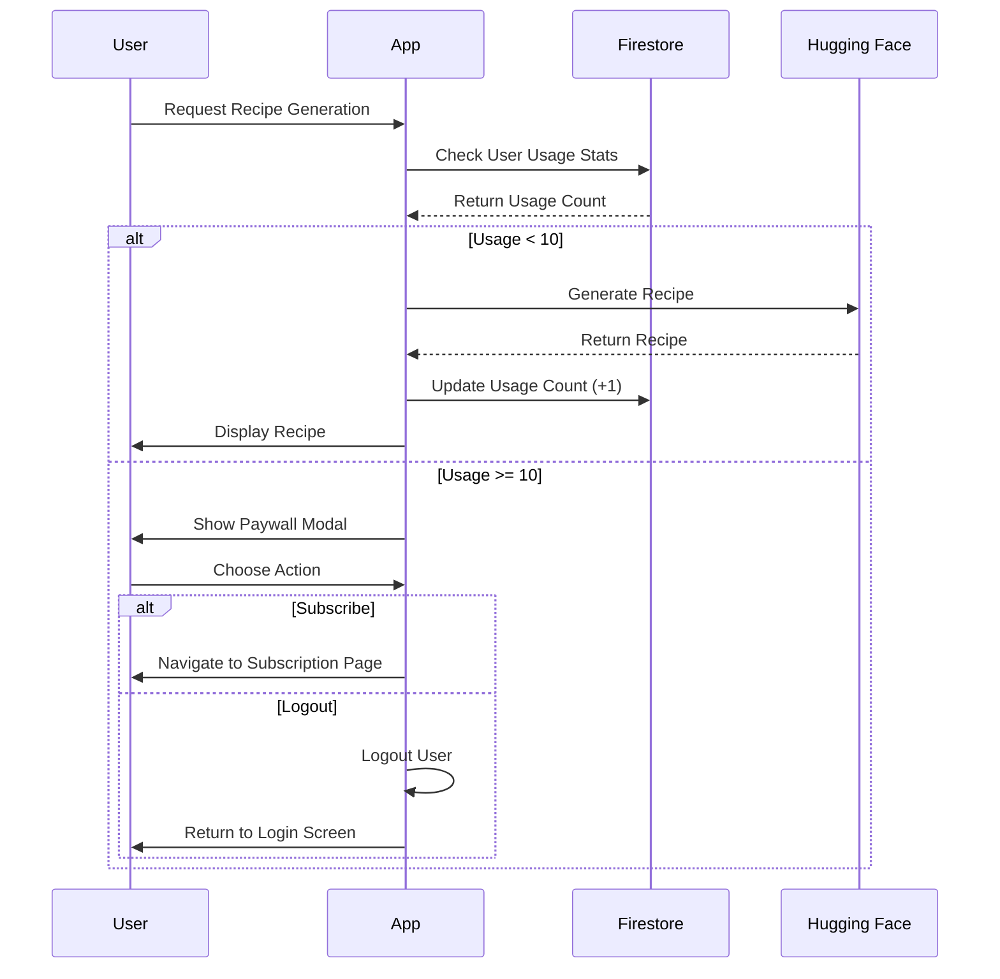
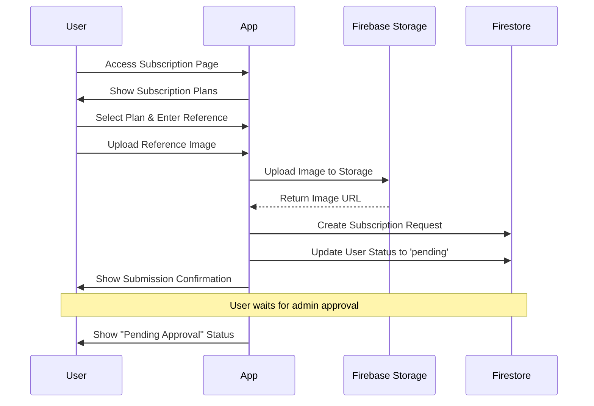
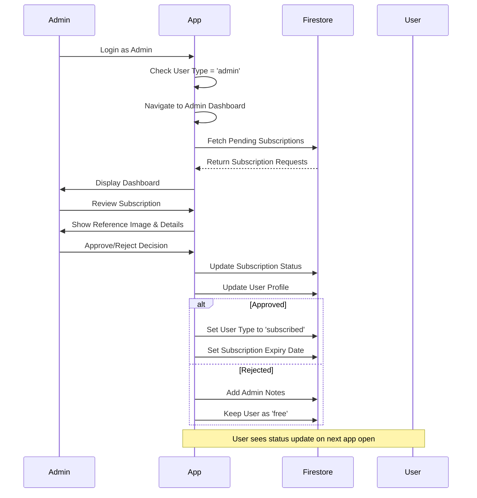
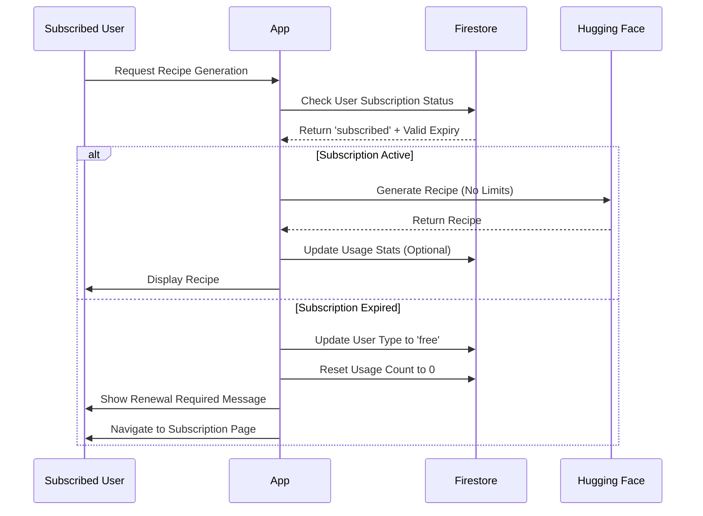

# KitchenPal Subscription System Plan

## Overview

This document outlines the comprehensive subscription system implementation for KitchenPal, including usage limits, paywall functionality, subscription management, and admin dashboard.

## Requirements Analysis

### Core Features

1. **Usage Limits**: Free users can search 10 times before hitting paywall
2. **Paywall**: Block access after limit, require subscription or force logout
3. **Subscription Flow**: Users can upload payment reference image via Firebase Storage
4. **Admin Dashboard**: Admin users can view and verify subscriptions
5. **Access Control**: Subscribed users get unlimited recipe generation

### User Types

- **Free User**: Limited to 10 recipe generations
- **Subscribed User**: Unlimited recipe generations
- **Admin User**: Access to subscription management dashboard

## Enhanced Data Models

### Updated UserProfile Interface

```typescript
interface UserProfile {
  id: string;
  firstName: string;
  middleName?: string;
  lastName: string;
  birthday: Date;
  gender: string;
  email: string;
  userType: "free" | "subscribed" | "admin";
  subscription?: SubscriptionInfo;
  usageStats: UsageStats;
  createdAt: Date;
  updatedAt: Date;
}

interface SubscriptionInfo {
  status: "pending" | "active" | "expired" | "rejected";
  planType: "monthly" | "yearly";
  submittedAt?: Date;
  approvedAt?: Date;
  expiresAt?: Date;
  referenceImageUrl?: string;
  referenceNumber?: string;
  adminNotes?: string;
}

interface UsageStats {
  recipeGenerationsCount: number;
  lastGenerationAt?: Date;
  monthlyGenerations: number;
  currentMonthStart: Date;
}
```

### Subscription Request Interface

```typescript
interface SubscriptionRequest {
  id: string;
  userId: string;
  userEmail: string;
  userName: string;
  planType: "monthly" | "yearly";
  referenceNumber: string;
  referenceImageUrl: string;
  status: "pending" | "approved" | "rejected";
  submittedAt: Date;
  reviewedAt?: Date;
  reviewedBy?: string; // Admin user ID
  adminNotes?: string;
}
```

## Sequence Diagrams

### 1. Free User Recipe Generation Flow



### 2. Subscription Process Flow



### 3. Admin Approval Flow



### 4. Subscribed User Flow



## Implementation Phases

### Phase 1: Usage Tracking & Paywall

**Duration**: 2-3 days

**Components to Implement**:

1. Enhanced UserProfile with usage tracking
2. Usage limit checking in recipe generation
3. Paywall modal component
4. User logout functionality when limit exceeded

**Key Files to Modify**:

- `types/user.ts` - Add subscription and usage fields
- `hooks/useRecipeGenerator.ts` - Add usage checking
- `components/PaywallModal.tsx` - New component
- `hooks/useAuth.ts` - Add usage tracking functions

### Phase 2: Subscription Flow

**Duration**: 3-4 days

**Components to Implement**:

1. Subscription page with plan selection
2. Image upload functionality with Firebase Storage
3. Subscription request submission
4. Pending status display

**Key Files to Implement**:

- `app/home/subscription.tsx` - Main subscription page
- `components/SubscriptionPlanCard.tsx` - Plan display
- `components/ImageUpload.tsx` - Reference image upload
- `hooks/useSubscription.ts` - Subscription management
- `hooks/useStorage.ts` - Enhanced for image uploads

### Phase 3: Admin Dashboard

**Duration**: 3-4 days

**Components to Implement**:

1. Admin role detection and routing
2. Admin dashboard with subscription requests
3. Image viewer for reference verification
4. Approval/rejection functionality
5. User management interface

**Key Files to Implement**:

- `app/admin/` - New admin section
- `app/admin/dashboard.tsx` - Main admin dashboard
- `app/admin/subscription-requests.tsx` - Request management
- `components/admin/` - Admin-specific components
- `hooks/useAdmin.ts` - Admin functionality

## Database Structure

### Firestore Collections

#### users (Enhanced)

```javascript
{
  id: "user_firebase_uid",
  firstName: "John",
  lastName: "Doe",
  email: "john@example.com",
  userType: "free" | "subscribed" | "admin",
  subscription: {
    status: "active",
    planType: "monthly",
    approvedAt: timestamp,
    expiresAt: timestamp,
    referenceNumber: "REF123456"
  },
  usageStats: {
    recipeGenerationsCount: 5,
    lastGenerationAt: timestamp,
    monthlyGenerations: 5,
    currentMonthStart: timestamp
  },
  // ... other existing fields
}
```

#### subscription_requests (New)

```javascript
{
  id: "auto_generated_id",
  userId: "user_firebase_uid",
  userEmail: "john@example.com",
  userName: "John Doe",
  planType: "monthly",
  referenceNumber: "REF123456",
  referenceImageUrl: "gs://bucket/images/ref123.jpg",
  status: "pending",
  submittedAt: timestamp,
  reviewedAt: timestamp,
  reviewedBy: "admin_user_id",
  adminNotes: "Verified payment"
}
```

## Security Considerations

### Firestore Security Rules

```javascript
// Users collection - enhanced rules
match /users/{userId} {
  allow read, write: if request.auth != null && request.auth.uid == userId;
  allow read: if request.auth != null &&
              get(/databases/$(database)/documents/users/$(request.auth.uid)).data.userType == 'admin';
}

// Subscription requests - admin only for approval
match /subscription_requests/{requestId} {
  allow read, create: if request.auth != null &&
                      request.auth.uid == resource.data.userId;
  allow read, write: if request.auth != null &&
                     get(/databases/$(database)/documents/users/$(request.auth.uid)).data.userType == 'admin';
}
```

### Firebase Storage Rules

```javascript
// Reference images - user can upload, admin can read
match /subscription_references/{userId}/{allPaths=**} {
  allow write: if request.auth != null && request.auth.uid == userId;
  allow read: if request.auth != null && (
    request.auth.uid == userId ||
    get(/databases/$(database)/documents/users/$(request.auth.uid)).data.userType == 'admin'
  );
}
```

## Testing Strategy

### Unit Tests

- Usage limit calculation
- Subscription status validation
- Image upload functionality
- Admin permission checks

### Integration Tests

- End-to-end subscription flow
- Admin approval process
- Paywall enforcement
- User experience flows

### Manual Testing Scenarios

1. New user reaches 10 generation limit
2. User submits subscription with image
3. Admin reviews and approves subscription
4. Subscribed user generates unlimited recipes
5. Subscription expiry handling

## Monitoring & Analytics

### Key Metrics to Track

- Free users hitting paywall
- Subscription conversion rate
- Admin response time
- User satisfaction post-subscription
- Monthly/yearly plan preferences

### Dashboard Widgets

- Total subscribers
- Pending subscription requests
- Revenue projections
- Usage statistics
- Admin activity logs

## Next Steps

1. **Review and Approval**: Get stakeholder approval on this plan
2. **Phase 1 Implementation**: Start with usage tracking and paywall
3. **Testing**: Comprehensive testing at each phase
4. **Phase 2 Implementation**: Subscription flow
5. **Phase 3 Implementation**: Admin dashboard
6. **Production Deployment**: Gradual rollout with monitoring

## Notes

- All subscription plans will be manually verified by admin
- Reference image upload is required for verification
- Admin account will be created manually in Firebase console
- Subscription expiry will be automatically checked and enforced
- Users can resubscribe after expiry through the same flow
